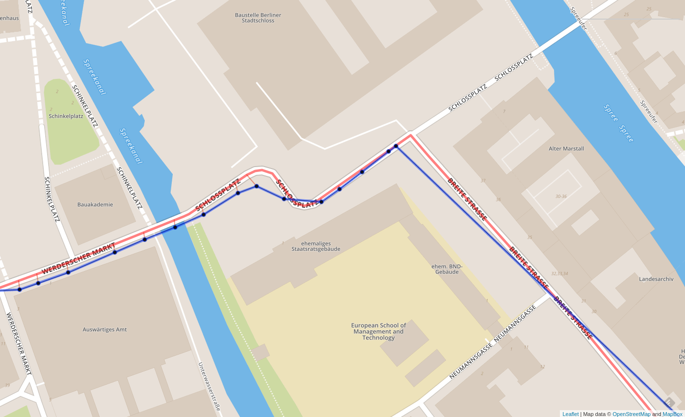

     ██▒   █▓ ▄▄▄       ██▓     ██░ ██  ▄▄▄       ██▓     ██▓    ▄▄▄      
    ▓██░   █▒▒████▄    ▓██▒    ▓██░ ██▒▒████▄    ▓██▒    ▓██▒   ▒████▄    
     ▓██  █▒░▒██  ▀█▄  ▒██░    ▒██▀▀██░▒██  ▀█▄  ▒██░    ▒██░   ▒██  ▀█▄  
      ▒██ █░░░██▄▄▄▄██ ▒██░    ░▓█ ░██ ░██▄▄▄▄██ ▒██░    ▒██░   ░██▄▄▄▄██ 
       ▒▀█░   ▓█   ▓██▒░██████▒░▓█▒░██▓ ▓█   ▓██▒░██████▒░██████▒▓█   ▓██▒
       ░ ▐░   ▒▒   ▓▒█░░ ▒░▓  ░ ▒ ░░▒░▒ ▒▒   ▓▒█░░ ▒░▓  ░░ ▒░▓  ░▒▒   ▓▒█░
       ░ ░░    ▒   ▒▒ ░░ ░ ▒  ░ ▒ ░▒░ ░  ▒   ▒▒ ░░ ░ ▒  ░░ ░ ▒  ░ ▒   ▒▒ ░
         ░░    ░   ▒     ░ ░    ░  ░░ ░  ░   ▒     ░ ░     ░ ░    ░   ▒   
          ░        ░  ░    ░  ░ ░  ░  ░      ░  ░    ░  ░    ░  ░     ░  ░
         ░                                                                    

Valhalla is an open source routing engine and accompanying libraries for use with Open Street Map data. This library/service, Meili, provides map matching functionality to matches a sequence of locations (usually noisy e.g. GPS trajectory) to the underlying road network. In keeping with the Norse mythological theme, the name [Meili](http://en.wikipedia.org/wiki/Meili), Thor's brother, was chosen. Since map matching is closely related to routing and since Thor is the Valhalla routing library, meili seemed most appropriate. Additionally the main author of this software, @ptpt from team [Mapillary](https://github.com/mapillary)  noted that, mĕilì (美丽) means beautiful in Chinese. This is indeed a beautiful collaboration between team Mapillary and team Valhalla! Open source FTW!

Build Status
------------

Building
--------

Baldr uses the [GNU Build System](http://www.gnu.org/software/automake/manual/html_node/GNU-Build-System.html) to configure and build itself. To install on a Debian or Ubuntu system you need to install its dependencies with:

    srcipts/dependencies.sh

And then run to install it:

    scripts/install.sh

Please see `./configure --help` for more options on how to control the build process.

Getting Started
---------------

Follow this [tutorial](https://github.com/valhalla/meili/blob/master/docs/run_service_in_docker.md) to get the service run in Docker.

Documentation
-------------

1. [Service API](https://github.com/valhalla/meili/blob/master/docs/service_api.md)
2. [Library API](https://github.com/valhalla/meili/blob/master/docs/library_api.md)
3. [Configuration](https://github.com/valhalla/meili/blob/master/docs/configuration.md)
4. [The Algorithms](https://github.com/valhalla/meili/blob/master/docs/algorithms.md)

Contributing
------------

We welcome contributions to meili. If you would like to report an issue, or even better fix an existing one, please use the [meili issue tracker](https://github.com/valhalla/meili/issues) on GitHub.

If you would like to make an improvement to the code, please be aware that all valhalla projects are written mostly in C++11, in the K&R (1TBS variant) with two spaces as indentation. We generally follow this [c++ style guide](http://google-styleguide.googlecode.com/svn/trunk/cppguide.html). We welcome contributions as pull requests to the [repository](https://github.com/valhalla/meili) and highly recommend that your pull request include a test to validate the addition/change of functionality.

Tests
-----

We highly encourage running and updating the tests to make sure no regressions have been made. We use the Automake test suite to run our tests by simply making the `check` target:

    make check

You can also build a test coverage report. This requires that the packages `lcov`, `gcov` and `genhtml` be installed. On Ubuntu you can get these with:

    sudo apt-get install lcov

To make the coverage report, configure the build for it:

    ./configure --enable-coverage

And generate an HTML coverage report in the `coverage/` directory:

    make coverage-report

Note also that, because calculating the coverage requires compiler support, you will need to clean any object files from a non-coverage build by running `make clean` before `make coverage-report`.

