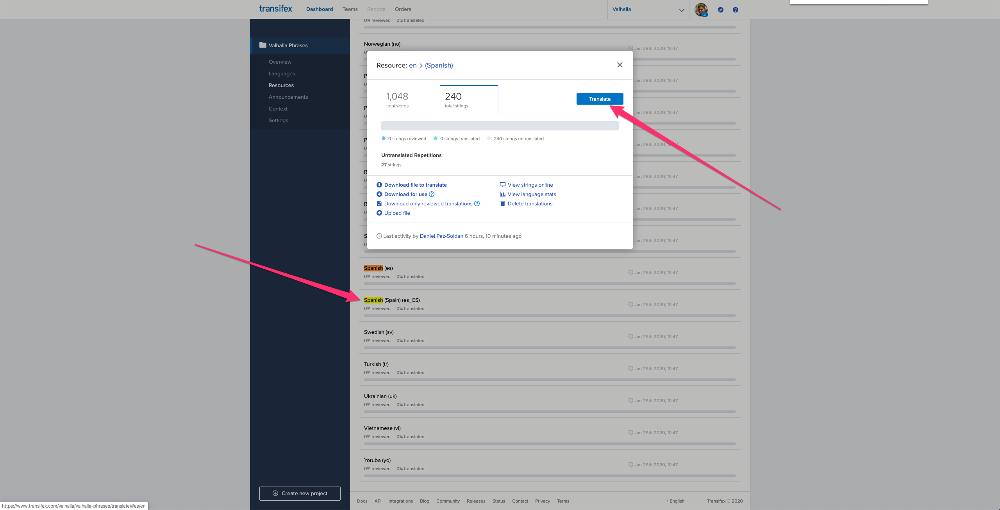
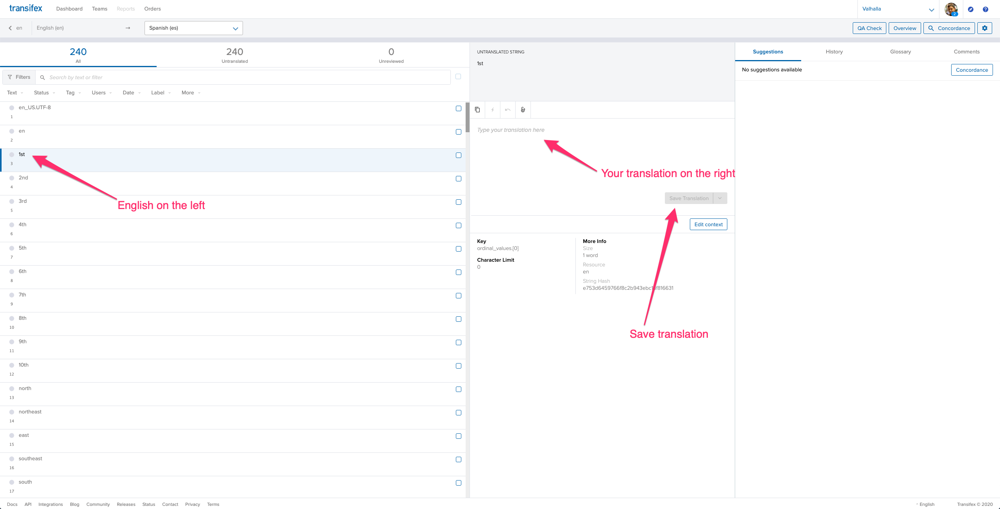

# Narrative Language Files

Valhalla supports localized instructions in multiple languages for both textual and verbal phrases.

## Contributing Translations

Thank you contributing to Valhalla translations!

We use [Transifex](https://www.transifex.com/) to enable anyone from the community to contribute translations to Valhalla. Go to the [Valhalla Phrases project in Transifex](https://www.transifex.com/valhalla/valhalla-phrases/) where you can choose to review and update existing translations, or contribute a new language. You will need a Transifex account to contribute to the project.

Here's an overview of the translator's workflow:
1. Go to https://www.transifex.com/valhalla/valhalla-phrases and request to join the Transifex translator team for the Valhalla Phrases project.

2. Select one of the available languages to contribute to, or suggest a new language.

3. You will then be taken to the translator dashboard. The English phrase will be on the left, and you should enter your translation in the input box to the right. Make sure to save your translation!

4. When you've finished making your contributions they will be marked as "ready for review".

5. That's it! Thank you for your contribution!

# Internal Documentation

### Updating languages or adding new languages

There is a Transifex GitHub integration installed on the Valhalla repository. It is responsible for syncing translation updates from the Transifex website to the Valhalla repo by making automated PRs with the updates.

Follow these steps to sidestep Transifex and update language files directly:

1. Edit the `*.yml` language files in this locales directory, or add a new language file with the exact same structure as the other languages. Do not edit the JSON files directly, as we use the yaml files to build the JSON source files.

2. Copy the [en-US.yml](en-US.yml) to `<NEW_LANGUAGE_TAG>.yml`
Using [IETF BCP 47](https://tools.ietf.org/html/bcp47) as reference - the typical format for the `<NEW_LANGUAGE_TAG>` is:
<[ISO 639 two-letter language code](https://en.wikipedia.org/wiki/List_of_ISO_639-1_codes)>-<[ISO 3166 two-letter country code](https://en.wikipedia.org/wiki/ISO_3166-1_alpha-2)>
Czech/Czech Republic example:
`cs-CZ`

3. Update the `posix_locale` value in your new file. The character encoding must be UTF-8. The typical format is:
<[ISO 639 two-letter language code](https://en.wikipedia.org/wiki/List_of_ISO_639-1_codes)>_<[ISO 3166 two-letter country code](https://en.wikipedia.org/wiki/ISO_3166-1_alpha-2)>.UTF-8
Czech/Czech Republic `posix_locale` example:
`cs_CZ.UTF-8`

4. Update the `aliases` array in your new file. A typical alias entry is the [ISO 639 two-letter language code](https://en.wikipedia.org/wiki/List_of_ISO_639-1_codes) without the
[ISO 3166 two-letter country code](https://en.wikipedia.org/wiki/ISO_3166-1_alpha-2). The alias entry must be unique across language files.
Czech `aliases` entry example:
`cs`

5. Once you have a complete yaml translation file, run `./build.py` to generate the JSON language file.

6. Run `make check` to verify the tests pass.

7. Update Transifex with the new translations.

### Adding new phrases in existing languages

1. Add the new phrases in en-US.yml.
2. Add the new phrases in each other language file, translating as you add to each file. If you are unsure about a translation
3. Update the English strings in each language file.
